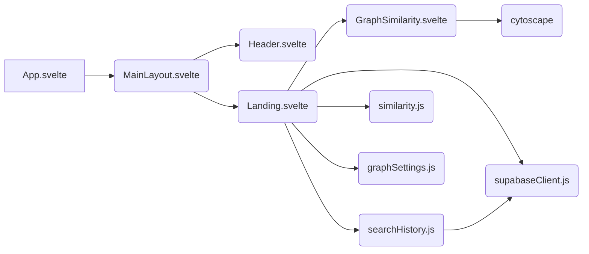
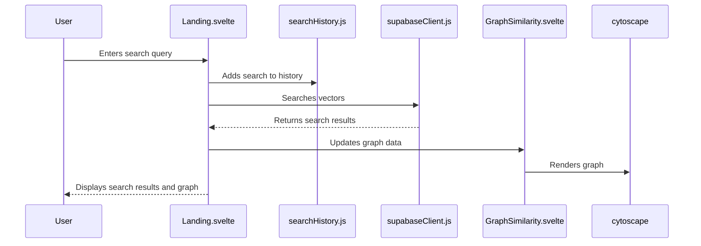
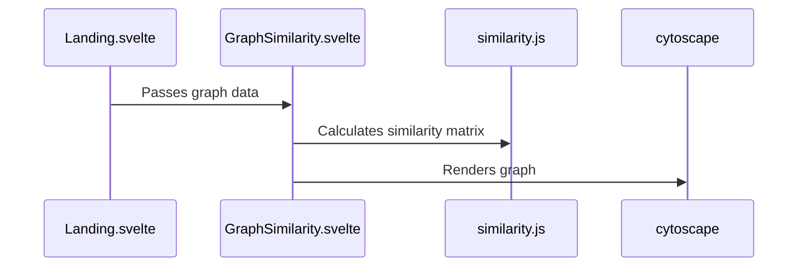
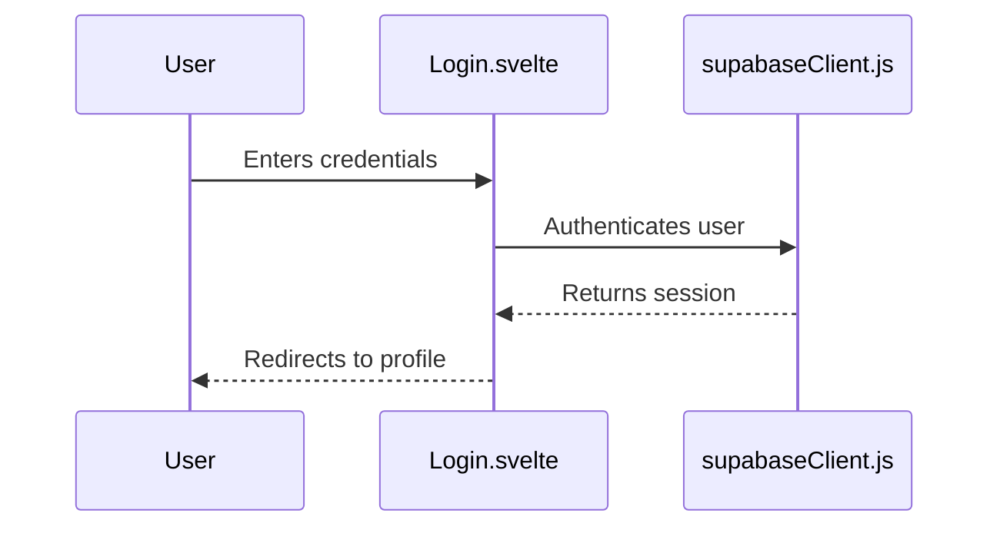
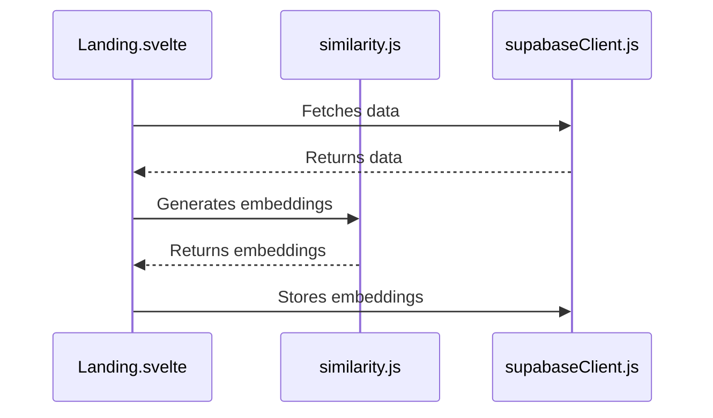

# Code Structure Documentation

## 1. Project Overview

This project is a Svelte application with Supabase integration for searching and visualizing Alberta Open Data. The application uses vector embeddings for semantic search and graph visualization.

## 2. Application Architecture

### Routing System
The application uses a simple routing system based on the `src/lib/stores/route.js` store and the `routes.js` file.

### Component Hierarchy
The main layout is defined in `src/lib/layouts/MainLayout.svelte`, which includes a header and a slot for the main content.

### Store Management
The application uses Svelte stores for managing application state, including:
- `src/lib/stores/route.js`: Manages the current route
- `src/lib/stores/graphSettings.js`: Manages graph display settings
- `src/lib/stores/searchHistory.js`: Manages search history

### Data Flow
Data flows from Supabase to the components through the use of vector embeddings and similarity calculations.

### Authentication Flow
The application uses Supabase for authentication, with components for login, signup, and user profile management.

### Search Functionality
The search functionality is implemented in the `src/lib/pages/Landing.svelte` component, which uses vector embeddings to search for similar documents.

### Graph Visualization
The graph visualization is implemented using Cytoscape in the `src/lib/components/GraphSimilarity.svelte` component.

## 3. Call Stack Diagram

## 4. Workflow Diagrams

### User Search Flow

### Graph Visualization Flow

### Authentication Flow

### Data Processing Flow

## 5. Key Components and Their Relationships

- `src/App.svelte`: Main application component that handles routing.
- `src/lib/layouts/MainLayout.svelte`: Provides the main layout for the application.
- `src/lib/pages/Landing.svelte`: Implements the landing page with search functionality and graph visualization.
- `src/lib/components/GraphSimilarity.svelte`: Renders the graph visualization using Cytoscape.
- `src/lib/stores/route.js`: Manages the current route.
- `src/lib/stores/graphSettings.js`: Manages graph display settings.
- `src/lib/stores/searchHistory.js`: Manages search history.
- `src/lib/utils/similarity.js`: Implements similarity calculation functions.
- `src/lib/supabaseClient.js`: Initializes the Supabase client.

## 6. Technical Implementation Details

### Vector Similarity Calculation
The application uses cosine similarity to calculate the similarity between vector embeddings.

### Community Detection with Louvain Algorithm
The application uses the Louvain algorithm to detect communities in the graph.

### Graph Rendering with Cytoscape
The application uses Cytoscape to render the graph visualization.

### Supabase Integration
The application uses Supabase for authentication and data storage.
